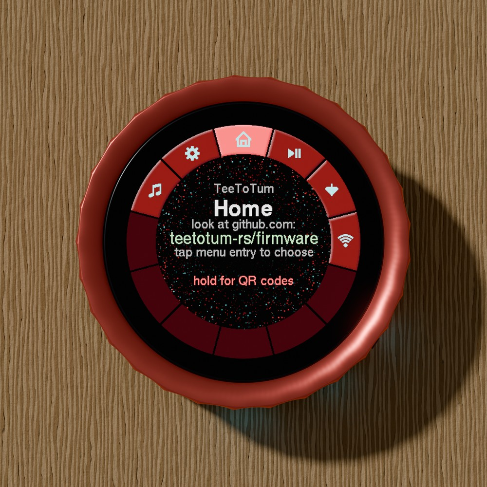
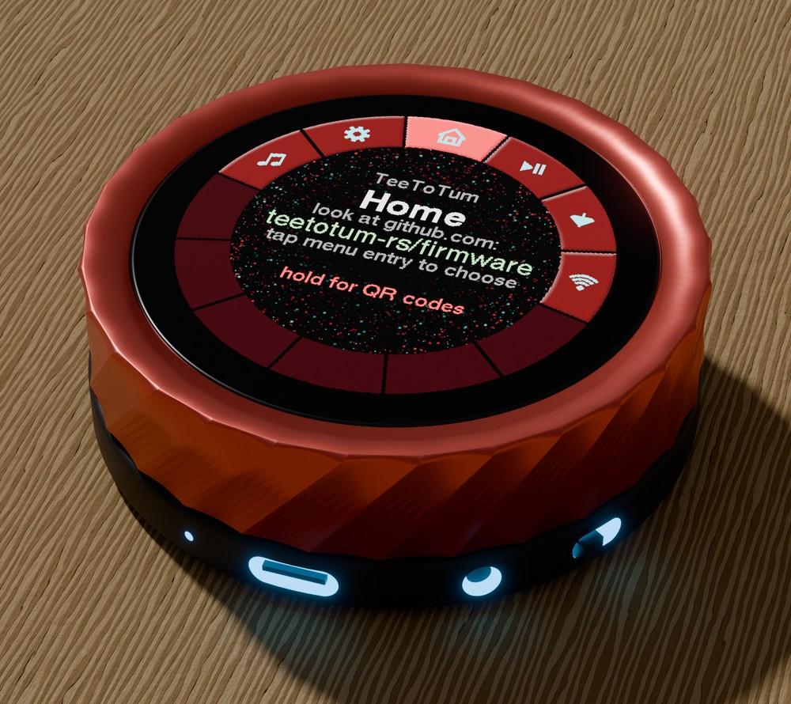

# TeeToTum

`no_std` Rust with [esp-hal](https://github.com/esp-rs/esp-hal) for the
**Waveshare ESP32-S3 1.8" Knob Display** (The Pi Hut SKU `WAV-31624`) — a round 360×360 screen
with a rotary knob around it, a haptic motor under it, and a second microcontroller behind it
that does Bluetooth audio.

A teetotum is the spinning top you turn between thumb and forefinger — the gesture the device is
built around. The firmware is a ring menu you turn to, plus a host for **plugins**: small
WebAssembly modules that get a screen of their own. Three come with it.

<p align="center">
  
</p>

<p align="center"><em>Renders, not photographs: the model is a script,
<a href="tools/render-device.py"><code>tools/render-device.py</code></a>, and the screen content
is drawn to the same layout rules the firmware uses.</em></p>

> **A hobby project, and a work in progress.** It runs on one device, the author's. Nothing here
> is a product, a roadmap or a promise; interfaces change without notice until there is a
> release on crates.io.
>
> **Written by a person and a language model together.** Every hardware claim in this repository
> was measured on the device; the prose and most of the code were drafted by Claude Code and
> then read, judged and corrected by hand. [How this was made](#how-this-was-made) says exactly
> who did what.

## What it does today

- **Home is a ring** of twelve segments: turn the knob to a segment, tap to choose, tap the
  centre to open. Holding a finger on the glass goes back to Home; in an open dialog it cancels
  first. Holding on Home itself opens a ring of QR codes: the firmware, the hardware, the plugin
  guide, the projects it is built on and where to report a problem.
- **A music player** for whatever the phone is playing — title, artist, cover art and a volume
  arc — over the classic ESP32 next to the S3, which is the chip the phone is paired with.
- **Settings that survive a power cut**: eleven colour themes, the picture's orientation in
  twelve 30° steps, ten backlight levels, ten click strengths, the dot-cloud background, and
  how the cover art is scaled. Written to two alternating flash sectors, not to a file.
- **Plugins as WebAssembly**, loaded at runtime under [wasmi](https://github.com/wasmi-labs/wasmi),
  each with a manifest of rights the firmware enforces. Beyond the bundled ones, sixteen flash
  slots take plugins written over USB and accepted on the glass. Bundled: a HID remote for the phone's
  player, a die that rolls when you turn the knob, and *Nearby*, which draws the Wi-Fi and
  Bluetooth signals around it as a radar.
- **Drivers for all of it in one SDK crate**: the ST77916 panel over QSPI at 80 MHz, the CST816D
  touch controller, the knob on a GPIO interrupt, the DRV2605L haptic driver, a read-only
  FAT16/32 reader for the TF card, and the UART link to the other chip.

Not there: sound of its own (the loudspeaker belongs to the other microcontroller — see
[Audio](docs/hardware/audio.md)), loading a plugin over the air, and writing to the card.

## Documentation

| | For | What it covers |
|---|---|---|
| [User guide](docs/user-guide.md) | anyone with a Knob running TeeToTum | the controls, Home, the player, every setting, troubleshooting |
| [Using plugins](docs/plugins.md) | anyone who starts or removes plugins | the bundled three, rights, what "stopped" means, memory, installing more |
| [Writing plugins](docs/plugin-development.md) | Rust developers | the `teetotum-face` SDK, the manifest, events, drawing, limits |
| [The hardware, as measured](docs/hardware/README.md) | anyone curious about the board | what the device answered when it was asked: pins, panel, touch, knob, haptics, audio, the companion link, the card, the radios |

All of it is plain Markdown with no images to fetch, so it reads the same offline in a text
editor as it does on a code host.

## The board has two microcontrollers

This is the one thing to know before plugging it in: an **ESP32-S3** drives the screen, touch,
knob and haptics, and a **classic ESP32** next to it does Classic Bluetooth and audio. **Which
of the two appears on USB depends on which way round the Type-C plug is inserted** — flip the
plug and you flip the chip. If `lsusb` shows a CH340 instead of `303a:1001`, the plug is the
wrong way round.

<p align="center">
  
  <br>
  <sub>The blue glow is not real. It only marks the openings in the base, which are black on
  black on the device: microphone, USB-C, headphone jack and power switch.</sub>
</p>

This firmware runs on the S3. It talks to the other chip over a UART at 921600 baud and leaves
its factory firmware in place. Details, and everything else measured on this board, are in
[`docs/hardware/`](docs/hardware/README.md).

## Building and flashing

```
espup        0.17.1   # installs the Xtensa Rust toolchain (channel "esp")
espflash / cargo-espflash 4.5.0
```

The toolchain is selected by `rust-toolchain.toml` (`channel = "esp"`). Source the espup
environment in every new shell (`. ~/export-esp.sh`); without it the linker is not found. On Linux your user
needs to be in the `dialout` group — then none of this needs `sudo`.

```
cargo build --release
cargo run --release          # espflash flash --monitor, see .cargo/config.toml
espflash board-info -B 921600   # chip, revision, flash size, MAC
espflash monitor -B 921600      # read along without writing
```

**Pass `-B 921600` to espflash.** Over USB-Serial-JTAG the default baud rate is painfully slow —
93 s per megabyte — and long transfers abort with `Timeout while running command`. At 921600 the
same megabyte takes 14 s, reading and writing alike.

The three bundled plugins are built by their own `build.sh` into `firmware/assets/plugins/`,
because a face builds for `wasm32v1-none` and cargo takes the target per invocation. The
[user guide](docs/user-guide.md) has the long version of all of this.

## Layout

The repository is a Cargo workspace, cut along the crate rather than along the code: what a
plugin author will build against is `teetotum-face`, once it is on crates.io; until then the bundled
plugins use it by path.

| | |
|---|---|
| `teetotum/` | the SDK crate — glass, knob, touch, haptics, card, and the link to the other chip |
| `teetotum-face/` | what a plugin (a *face*) is written against — the `face!` macro, events, colours, HID usages, icons; no dependencies, builds for wasm32 and Xtensa |
| `firmware/` | the firmware, and the bring-up runs in `firmware/src/bin` that measured the board |
| `plugins/` | the three bundled faces, plus `dummy`, a do-nothing face whose nine copies show the menu pages; each built by its own `build.sh` |
| `backup/` | how to get the factory firmware back, and what it contained |
| `docs/` | the guides above |

`teetotum-face` is a workspace member and the firmware depends on it, so a break in its
interface fails this build rather than somebody else's.

The project was generated with `esp-generate` 1.3.0, and that single package is what is now
`firmware/`:

```
esp-generate --headless --chip esp32s3 \
  -o alloc -o embassy -o log -o esp-backtrace -o unstable-hal \
  -o wifi -o ble-trouble \
  knob-display-rust
```

Of the two BLE options the generator offers, this one uses **`ble-trouble`**
([TrouBLE](https://github.com/embassy-rs/trouble), `trouble-host` on crates.io) rather than
`ble-bleps`, which the generator pulls from a Git revision of a personal repository — a
published project should not depend on a pinned commit in someone's fork.

## What you can break with it

**Flashing this replaces the factory demo.** It did so here on 2026-09-04, including the factory
partition table. A full 16 MB image taken beforehand is in `backup/`, and writing it back has
been done once — but a device is a device: improper handling, a wrong flash offset or a
half-finished write can leave it in a state you have to recover by hand, and nobody owes you a
working Knob afterwards. There is no warranty; see the licences.

The **TF card is never at risk** — the on-board flash and the card are separate storage, and
`espflash` only writes to the flash. Getting at the card means opening the case, which this
project does not do.

Two things this repository deliberately does **not** contain: the factory firmware images
themselves, and any excerpt, dump or disassembly listing of them. Where the hardware
documentation cites an address inside the other chip's firmware, that is a description of
observed behaviour, written down so the next person can check it on their own device.

## How this was made

The work was done by one person and [Claude Code](https://claude.com/claude-code) (Anthropic's
Claude models) working together, over the first half of September 2026. The split, honestly:

- **The measurements are the person's.** Every claim about this board came from the device —
  a logic level, a register read, a frame time, a byte on a wire, a finger on the glass. Runs
  whose result was a judgement ("is this scaler better?", "does the click feel right?") were
  decided by eye and by hand, at the device, and the answer went back into the code.
- **The code and the prose were mostly drafted by the model**, in a conversation: the person
  set the goal, chose between options, said what was wrong, and read the result. The firmware,
  the SDK, the bring-up runs in `firmware/src/bin` and this documentation all came out of that
  loop.
- **The reverse engineering of the other chip's factory firmware** — what its UART commands do,
  why it asks for a 200×200 cover art thumbnail, why its BLE HID role collides with its audio
  role — was done by reading its image, and then confirmed against the device wherever the
  device could confirm it. Where it could not, the text says so.
- **Nothing here was measured on more than one device.** Numbers like "80 MHz works" or "the
  encoder counts 37 to 41 detents per turn" are true of this board; another unit may differ.

If that mix matters to you — for citation, for trust, or for a bug report — the guides mark
what is measured, what is read out of a factory image, and what is still only a datasheet
claim.

## Acknowledgements

The board would have been a lot slower to understand without:

- **Waveshare**, for publishing the [wiki page](https://www.waveshare.com/wiki/ESP32-S3-Knob-Touch-LCD-1.8),
  the schematic and the demo sources for the ESP32-S3 Knob Touch LCD 1.8. They disagree with the
  device in two places (GPIO0 and the haptic enable), which is worth knowing and does not make
  them less useful.
- **[KrX3D/WaveShare-Knob-Esp32S3](https://github.com/KrX3D/WaveShare-Knob-Esp32S3)**, an
  ESPHome configuration for this board. The first version of the pin table here came from it, two
  days before Waveshare's own schematic turned up, and it contributed four rows: the touch reset
  and interrupt, the two I²C lines and the knob's two direction lines. Three of them have since
  answered for themselves on the device; the touch reset is still unconfirmed, because the
  controller replies whether the pin is pulsed or not. It is also the only other public project
  for this board found while working on this one — Waveshare's own
  `waveshareteam/ESP32-S3-Knob-Touch-LCD-1.8` is a 404, checked on 2026-09-12.
- **Espressif**, for esp-hal, esp-radio and the rest of the `esp-rs` stack, for the ESP32-S3
  technical reference manual, and for ESP-IDF and the ESP-BSP — the backlight's LEDC settings
  are theirs, and the factory firmware's own behaviour is only legible because ESP-IDF's
  examples are public.
- **Texas Instruments** for the DRV2605L datasheet, and **Hynitron** for the CST816 family
  register map.
- **The Bluetooth SIG** specifications for AVRCP and the Basic Imaging Profile, and the
  **USB-IF HID usage tables**, which together explain what the other chip is doing on the air.
- The crates this firmware is built from: `esp-hal`, `esp-radio`, `esp-rtos`, `esp-alloc`,
  `esp-storage`, `esp-bootloader-esp-idf`, `esp-println`, `esp-backtrace`, the `embassy-*`
  family, `embedded-graphics`, `embedded-io`, `embedded-storage`, `smoltcp`, `trouble-host`,
  `bt-hci`, `st77916`, `u8g2-fonts`, `wasmi`, `zune-jpeg`, `static_cell`, `critical-section`
  and `log` — and the tools `espup`, `esp-generate` and `espflash`.
- **U8g2**, whose bitmap fonts the menus are set in.

## License

Dual-licensed under either

- [Apache License, Version 2.0](LICENSE-APACHE)
- [MIT license](LICENSE-MIT)

at your option, and that covers everything here: code, documentation and pictures. This is the
usual choice in the Rust ecosystem, and it is deliberate — plugins are meant to come from other
people, and neither writing one nor building this firmware into something else should drag a
licence obligation along.

One exception travels inside the binary: the menus are set in Helvetica, the X11 bitmap fonts
that U8g2 carries, which are not under either licence above but under Adobe's and Digital
Equipment Corporation's permission notice. It allows use, modification and redistribution
provided the notice goes along; it is in [`teetotum/LICENSE-FONTS`](teetotum/LICENSE-FONTS).
Every crate that ends up in the firmware image is listed with its licence in
[`THIRD-PARTY.md`](THIRD-PARTY.md).

Unless you explicitly state otherwise, any contribution intentionally submitted for inclusion in
this work by you, as defined in the Apache-2.0 license, shall be dual-licensed as above, without
any additional terms or conditions.
